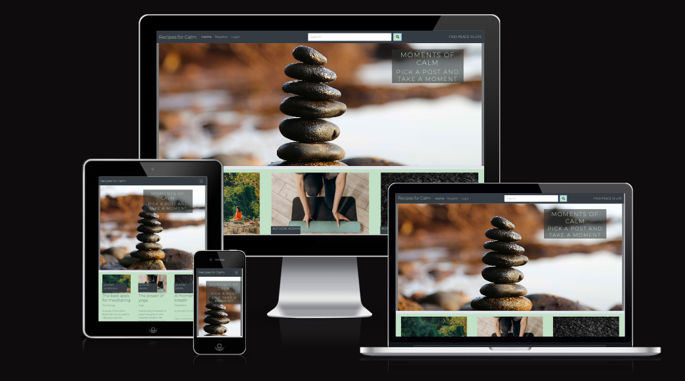
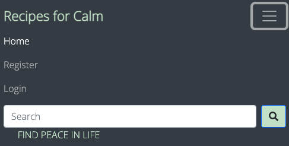

# Recipes for Calm - Introduction

Recipes for Calm is my 4th project with Code Institute and is a Full Stack website using the Django framework. It is designed as a website for users to find short blog posts with information on creating more calm in life. When a user is logged into the site they can like or unlike posts and comment on posts. They can edit or delete their own posts also. 

[Live Project Here](https)

## Content

  - [User Experience - UX](#user-experience---ux)
    - [User Stories](#user-stories)
    - [Agile Methodology](#agile-methodology)
    - [The Scope](#the-scope)
      - [Main Site Goals](#main-site-goals)
  - [Design](#design)
      - [Colours](#colours)
      - [Typography](#typography)
      - [Imagery](#imagery)
  - [Database Diagram](#database-diagram)
  - [Features](#features)
    - [Home Page](#home-page)
    - [Post Detail Page](#post-detail-page)
    - [Post Detail Page - Comments](#post-detail-page---comments)
    - [Edit Comments Page](#edit-comments-page)
    - [Search Box](#search-box)
    - [Search Results Page](#search-results-page)
    - [Search Results - No Results Found](#search-results---no-results-found)
    - [Signup Page](#signup-page)
    - [Login Page](#login-page)
    - [Logout Page](#logout-page)
    - [Navbar](#navbar)
    - [Footer](#footer)
  - [Admin Panel/Superuser](#admin-panelsuperuser)
  - [Technologies Used](#technologies-used)
    - [Languages Used](#languages-used)
      - [Django Packages](#django-packages)
    - [Frameworks - Libraries - Programs Used](#frameworks---libraries---programs-used)
    - [Testing](#testing)
  - [Creating the Django app](#creating-the-django-app)
  - [Deployment of This Project](#deployment-of-this-project)
  - [Final Deployment](#final-deployment)
  - [Forking This Project](#forking-this-project)
  - [Cloning This Project](#cloning-this-project)
  - [Credits](#credits)
    - [Content](#content)
    - [Information Sources / Resources](#information-sources--resources)
  - [Special Thanks](#special-thanks)

## User Experience - UX

### User Stories

* As a website user, I can:

1. Navigate the site and view content.
2. View a list of posts and choose accordingly.
3. Click on post to read the details.
4. Register for an account or login if I already have an account.
6. View the number of likes and comments on a post.
7. Read user comments on each post.

* As logged in website user, I can:

1. Like/unlike posts to indicate which I enjoyed.
2. Comment on posts to join coversation around the post.
3. Delete and edit my own comments.
4. Logout from the website.

* As a website superuser, I can:

1. Create and publish posts.
2. Create and review draft posts.
3. Approve and delete user comments.

### Agile Methodology

GitHub Projects were used to manage development of the project and can be found
[here](https://github.com/users/lauralola/projects/3)

### The Scope

#### Main Site Goals

* To provide users with a easy to use, well designed and attractive website with content for creating calm.
* To provide a clear purpose evident from first use of the website.
* To provide different leveles of access and interactions with the website based on permissions.
* To provide ways for users to interact with the content through likes and comments.

## Design

#### Colours

* The colour scheme is kept simple using muted green and grey tones throughout. This was also used to provide clear visibility of content as the user navigates the website. The background is kept a pale grey colour with a darker grey text used. The navigation uses a dark grey background with a pale green text to select pages. Buttons use a pale pink colour to highlight and hovering over links to full blog posts highlights in a bright green colour. 

#### Typography

* The Open Sans font is used as the main font for the whole project and the sans Serif font as a backup font. This was for consistency throughout the site and readability for users. 

#### Imagery

* There is only one static image used for the site as the homepage background. All other images are uploaded via Cloudinary to the database.

## Database Diagram

 

## Features

### Home Page

(./assets/readme_images/home_2.png)

* The hero image welcomes the user with a short message advertising what the website is about. The navigation links are clearly evident along the top and beneath the hero image are small exerpts from posts with a link to see in detail. These are limited to 6 per page and are updated by most recent post 

### Post Detail Page

* On selecting a post to view, users are brought to a page with the full post for them to read. The image linked with the post is displayed at the top of the page, along with the author and date of publication.  Here users can comment and like and unlike posts once they are logged in. The number of comments and likes is also shown 

### Post Detail Page - Comments

 

* At the bottom of detailed post page, users can read the comments posted by other users. If the user is logged in or is a 
superuser they have access to the buttons for deleting or updating comments.

### Edit Comments Page

* If a user is logged in they can click a link beside their own comments and they are allowed to add, edit or delete their own comments. The website superuser can delete or update any comments on the blog without having to access the admin panel.

### Search Results Page

* On the Search Results Page, users can see the recipes found by their search.  When their recipe is located, the user can go to the Post Details Page by clicking on the card result.

### Search Results - No Results Found

* On the Search Results Page - No Results Found, users will see this message if there is nothing found for the search.

### Signup Page

* The new user is guided to complete a short form to access an account for further permissions on the site. Password length and complexity must be met. A message appears to confirm the user has been created and is logged in on successful account creation. 

### Login Page

* Registered users can login to the site using their registered username and password. A message appears to confirm successful login. 

### Logout Page

* Users confirm that they wish to logout and recieve a message pop up to confirm logout.

### Navbar

* The navigation bar is present at the top of every page and houses all links to the various other pages.
* The options to Register or Log in will change to the option to log out once a user has logged in.
* A search icon is nested in the navbar and once clicked it will open the search box.
* The navbar is fully responsive, collapsing into a hamburger menu when the screen size becomes smaller.

### Footer

* The footer contains links to all social media for the page. 

## Admin Panel/Superuser

* The admin panel allows superusers to view, create, edit and delete: 
1. Posts
2. Comments
3. Users
4. Email addresses

* Superusers can approve or delete comments by users.   

## Technologies Used

### Languages Used

* [HTML 5](https://en.wikipedia.org/wiki/HTML/)
* [CSS 3](https://en.wikipedia.org/wiki/CSS)
* [JavaScript](https://www.javascript.com/)
* [Django](https://www.python.org/)
* [Python](https://www.djangoproject.com/)

#### Django Packages

* [Gunicorn](https://gunicorn.org/) 
   As the server for Heroku
* [Cloudinary](https://cloudinary.com/) 
   Was used to host the static files and media
* [Dj_database_url](https://pypi.org/project/dj-database-url/) 
   To parse the database URL from the environment variables in Heroku
* [Psycopg2](https://pypi.org/project/psycopg2/) 
   As an adaptor for Python and PostgreSQL databases
* [Summernote](https://summernote.org/) 
   As a text editor
* [Allauth](https://django-allauth.readthedocs.io/en/latest/installation.html) 
   For authentication, registration, account
   management
* [Crispy Forms](https://django-crispy-forms.readthedocs.io/en/latest/) 
   To style the forms

### Frameworks - Libraries - Programs Used

* [Bootstrap](https://getbootstrap.com/) 
   Was used to style the website, add responsiveness and interactivity
* [Jquery](https://jquery.com/) 
   All the scripts were written using jquery library
* [Git](https://git-scm.com/) 
   Git was used for version control by utilizing the Gitpod terminal to commit to Git and push to GitHub
* [GitHub](https://github.com/) 
   GitHub is used to store the project's code after being pushed from Git
* [Heroku](https://id.heroku.com) 
   Heroku was used to deploy the live project
* [PostgreSQL](https://www.postgresql.org/) 
   Database used through heroku.
* [VSCode](https://code.visualstudio.com/) 
   VSCode was used to create and edit the website
* [Lucidchart](https://lucid.app/) 
   Lucidchart was used to create the database diagram
* [PEP8](http://pep8online.com/) 
   PEP8 was used to validate all the Python code
* [W3C - HTML](https://validator.w3.org/) 
   W3C- HTML was used to validate all the HTML code
* [W3C - CSS](https://jigsaw.w3.org/css-validator/) 
   W3C - CSS was used to validate the CSS code
* [Fontawesome](https://fontawesome.com/) 
   To add icons to the website
* [Google Chrome Dev Tools](https://developer.chrome.com/docs/devtools/) 
   To check App responsiveness and debugging
* [Google Fonts](https://fonts.google.com/) 
   To add the 2 fonts that were used throughout the project
* [Balsamiq](https://balsamiq.com/) 
   To build the wireframes for the project
* [PIXLR](https://pixlr.com) 
   To convert the images to webp format
* [CANVA](https://www.canva.com/) 
   To build the logos for the project
* [Coolors](https://coolors.co/) 
   To build the colour palette of the project
* [Emailjs](https://www.emailjs.com/) 
   To send emails from the contact form

### Testing

Testing results [here](TESTING.md)

## Creating the Django app

1. Go to the Code Institute Gitpod Full Template [Template](https://github.com/Code-Institute-Org/gitpod-full-template)
2. Click on Use This Template
3. Once the template is available in your repository click on Gitpod
4. When the image for the template and the Gitpod are ready open a new terminal to start a new Django App
5. Install Django and gunicorn: `pip3 install django gunicorn`
6. Install supporting database libraries dj_database_url and psycopg2 library: `pip3 install dj_database_url psycopg2`
7. Create file for requirements: in the terminal window type `pip freeze --local > requirements.txt`
8. Create project: in the terminal window type django-admin startproject your_project_name
9. Create app: in the terminal window type python3 manage.py startapp your_app_name
10. Add app to the list of installed apps in settings.py file: you_app_name
11. Migrate changes: in the terminal window type python3 manage.py migrate
12. Run the server to test if the app is installed, in the terminal window type python3 manage.py runserver
13. If the app has been installed correctly the window will display The install worked successfully! Congratulations!

## Deployment of This Project

* This site was deployed by completing the following steps:

1. Log in to [Heroku](https://id.heroku.com) or create an account
2. On the main page click the button labelled New in the top right corner and from the drop-down menu select Create New
App
3. You must enter a unique app name
4. Next select your region
5. Click on the Create App button
6. Click in resources and select Heroku Postgres database
7. Click Reveal Config Vars and add a new record with SECRET_KEY
8. Click Reveal Config Vars and add a new record with the `CLOUDINARY_URL`
9. Click Reveal Config Vars and add a new record with the `DISABLE_COLLECTSTATIC = 1`
10. The next page is the project’s Deploy Tab. Click on the Settings Tab and scroll down to Config Vars
11. Next, scroll down to the Buildpack section click Add Buildpack select python and click Save Changes
12. Scroll to the top of the page and choose the Deploy tab
13. Select Github as the deployment method
14. Confirm you want to connect to GitHub
15. Search for the repository name and click the connect button
16. Scroll to the bottom of the deploy page and select the preferred deployment type
17. Click either Enable Automatic Deploys for automatic deployment when you push updates to Github

## Final Deployment 

1. Create a runtime.txt `python-3.8.13`
2. Create a Procfile `web: gunicorn your_project_name.wsgi`
3. When development is complete change the debug setting to: `DEBUG = False` in settings.py
4. In this project the summernote editor was used so for this to work in Heroku add: `X_FRAME_OPTIONS = SAMEORIGIN `to
   settings.py.
5. In Heroku settings, delete the config vars for `DISABLE_COLLECTSTATIC = 1`

## Forking This Project

* Fork this project by following the steps:

1. Open [GitHub](https://github.com/PedroCristo/portfolio_project_4)
2. Find the 'Fork' button at the top right of the page
3. Once you click the button the fork will be in your repository

## Cloning This Project

* Clone this project by following the steps:

1. Open [GitHub](https://github.com/PedroCristo/portfolio_project_4)
2. You will be provided with three options to choose from, HTTPS, SSH or GitHub CLI, click the clipboard icon in order
to copy the URL
3. Once you click the button the fork will be in your repository
4. Open a new terminal
5. Change the current working directory to the location that you want the cloned directory
6. Type 'git clone' and paste the URL copied in step 3
7. Press 'Enter' and the project is cloned

## Credits

### Content

* All food recipes were taken from [BBC Goodfood](https://www.bbcgoodfood.com/recipes)
* The cookbook’s information and images were sourced from [Eason’s](https://www.easons.com/)
* The images were taken from [Unsplash](https://unsplash.com/)
* The Tasty Blog logos and favicon are my own design and build

### Information Sources / Resources

* [W3Schools - Python](https://www.w3schools.com/python/)
* [Stack Overflow](https://stackoverflow.com/)
* [Scrimba - Pyhton](https://scrimba.com/learn/python)

## Special Thanks

* Special thanks to my mentor Sandeep Aggarwal, my colleagues at Code Institute, Kasia Bogucka, and Mairéad Gillic for
their assistance throughout this project.