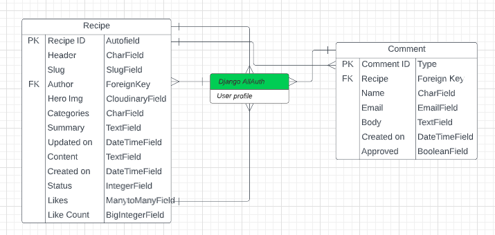
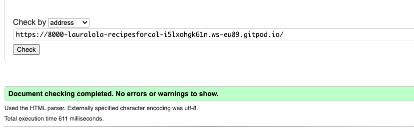

# Recipes for Calm - Introduction

Recipes for Calm is my 4th project with Code Institute and is a Full Stack website using the Django framework. It is designed as a website for users to find short blog posts with information on creating more calm in life. When a user is logged into the site they can like or unlike posts and comment on posts. They can edit or delete their own posts also. 

[Live Project Here](https)

## Content

  - [User Experience - UX](#user-experience---ux)
    - [User Stories](#user-stories)
    - [Agile Methodology](#agile-methodology)
    - [The Scope](#the-scope)
      - [Main Site Goals](#main-site-goals)
  - [Design](#design)
      - [Colours](#colours)
      - [Typography](#typography)
      - [Imagery](#imagery)
      - [Wireframes](#wireframes)
  - [Database Diagram](#database-diagram)
  - [Features](#features)
    - [Home Page](#home-page)
    - [Post Detail Page](#post-detail-page)
    - [Post Detail Page - Comments](#post-detail-page---comments)
    - [Edit Comments Page](#edit-comments-page)
    - [Search Results Page](#search-results-page)
    - [Signup Page](#signup-page)
    - [Login Page](#login-page)
    - [Logout Page](#logout-page)
    - [Navbar](#navbar)
    - [Footer](#footer)
    - [Future Features](#future-features)
  - [Admin Panel/Superuser](#admin-panelsuperuser)
  - [Technologies Used](#technologies-used)
    - [Languages Used](#languages-used)
      - [Django Packages](#django-packages)
    - [Frameworks - Libraries - Programs Used](#frameworks---libraries---programs-used)
    - [Testing](#testing)
  - [Creating the Django app](#creating-the-django-app)
  - [Deployment of This Project](#deployment-of-this-project)
  - [Final Deployment](#final-deployment)
  - [Credits](#credits)
    - [Content](#content)
    - [Information Sources / Resources](#information-sources--resources)
  - [Special Thanks](#special-thanks)

## User Experience - UX

### User Stories

* As a website user, I can:

1. Navigate the site and view content.
2. View a list of posts and choose accordingly.
3. Click on post to read the details.
4. Register for an account or login if I already have an account.
6. View the number of likes and comments on a post.
7. Read user comments on each post.
8. Search for relevant posts

* As logged in website user, I can:

1. Like/unlike posts to indicate which I enjoyed.
2. Comment on posts to join conversation around the post.
3. Delete and edit my own comments.
4. Logout from the website.

* As a website superuser, I can:

1. Create and publish posts.
2. Create and review draft posts.
3. Approve and delete user comments.

### Agile Methodology

GitHub Projects were used to manage development of the project and can be found
[here](https://github.com/users/lauralola/projects/3)

### The Scope

#### Main Site Goals

* To provide users with a easy to use, well designed and attractive website with content for creating calm.
* To provide a clear purpose evident from first use of the website.
* To provide different levels of access and interactions with the website based on permissions.
* To provide ways for users to interact with the content through likes and comments.

## Design

#### Colours

* The colour scheme is kept simple using muted green and grey tones throughout. This was also used to provide clear visibility of content as the user navigates the website. The background is kept a pale grey colour with a darker grey text used. The navigation uses a dark grey background with a pale green text to select pages. Buttons use a pale pink colour to highlight and hovering over links to full blog posts highlights in a bright green colour. 

#### Typography

* The Montserrat font is used as the main font for the whole project and the sans Serif font as a backup font. This was for consistency throughout the site and readability for users. 

#### Imagery

* There is only one static image used for the site as the homepage background. All other images are uploaded via Cloudinary to the database.

#### Wireframe

* Wireframe models were created using LucidSpark  
 

## Database Diagram

* Wireframe models were created using LucidChart
 

## Features

### Home Page

* The hero image welcomes the user with a short message advertising what the website is about. The navigation links are clearly evident along the top and beneath the hero image are small excerpts from posts with a link to see in detail. These are limited to 6 per page and are updated by most recent post 

### Post Detail Page

* On selecting a post to view, users are brought to a page with the full post for them to read. The image linked with the post is displayed at the top of the page, along with the author and date of publication.  Here users can comment and like and unlike posts once they are logged in. The number of comments and likes is also shown 

### Post Detail Page - Comments

 

* At the bottom of detailed post page, users can read the comments posted by other users. If the user is logged in or is a superuser they have access to the buttons for deleting or updating comments. If the comment field is left blank and submit clicked the user is prompted to fill in the field. 

### Edit Comments Page

* If a user is logged in they can click a link beside their own comments and they are allowed to add, edit or delete their own comments. The website superuser can delete or update any comments on the blog without having to access the admin panel.

### Search Results Page

* A user can user the search bar tool to find relevant articles. They are displayed below a message informing the user that if not results found please try another. If the user clicks the search button on an empty enquiry they will be informed that they forgot to search. 

### Signup Page

* The new user is guided to complete a short form to access an account for further permissions on the site. Password length and complexity must be met. A message appears to confirm the user has been created and is logged in on successful account creation. 

### Login Page

* Registered users can login to the site using their registered username and password. A message appears to confirm successful login. 

### Logout Page

* Users confirm that they wish to logout and receive a message pop up to confirm logout.

### Navbar

* The navigation bar is present at the top of every page and houses all links to the various other pages.
* The options to Register or Log in will change to the option to log out once a user has logged in.
* The navbar is fully responsive, collapsing into a hamburger menu when the screen size becomes smaller.

### Footer

* The footer contains links to all social media for the page. 

### Future Features

* Another feature in the Agile planning was to incorporate a class booking app for online classes as part of the site. This was not implemented due to time constraints. 

## Admin Panel/Superuser

* The admin panel allows superusers to view, create, edit and delete: 
1. Posts
2. Comments
3. Users
4. Email addresses

* Superusers can approve or delete comments by users.   

## Technologies Used

### Languages Used

* HTML
* CSS
* JavaScript
* Django
* Python

#### Django Packages

* Gunicorn
* Cloudinary
* DJ-database-url
* Pyscopg2 
* Summernote 
* Allauth 
* Crispy Forms 

### Frameworks - Libraries - Programs Used

* Git, Gitpod and Github
* Heroku
* PostgreSQL
* Fontawesome
* Google Chrome Dev Tools
* Google Fonts
* Lucidchart
* Lucidspark

### Testing

# Testing

* Testing was performed throughout the project. With new features added these were tested to ensure they were working as expected and if not debugging took place to try and rectify the issue. 

### Python Validation 
* Python testing was done using the CodeInstitue Heroku PEP8 validator to ensure there were no syntax errors in the project. All python files were entered into the online checker and no errors were found in any of the custom codes.

### Lighthouse
Lighthouse was used to test Performance, Best Practices, Accessibility and SEO on Desktop.

##### Desktop Results:
.

###### Mobile Results:
.

### HTML Validation
.

### CSS Validation

### JavaScript Validation
There is very little JavaScript included in this project but functionality for message pop-ups was tested. 
.

### Console Results:
* The browser console shows no errors.

## Manual Testing
.

### Frontend
* The Signup, Login and Logout system is working and shows the correct message to the users.
* Internal links are working and bring the user to the correct page on the website.
* External links are working and bring the user to the correct social media page in a new tab.
* The pagination system is working after 6 posts on the page a new page is added.
* Like/unlike functionality is working and shows message to the user when they have liked or unliked.
* Comment form submits a new comment for approval by admin once the form is completed by registered user. A message confirms this to user. It is displayed once approved.
* CRUD user functionality to edit and delete their own comments is working. The Bootstrap model opens to asking the user if they want to delete the message. Once confirmed, the comment is deleted and an interactive message is displayed at the top of the page. To edit comments, a new page opens to edit and an interactive message is displayed at the top of the page when submitted.

### Backend/Admin Panel
* All the models working to create, delete and update and perform as expected.  
* Admin approval of comments is working.
* When posting a new recipe, required fields must be filled to submit the post to the database.

## Bugs
* Several bug were fixed throughout the testing process. There was an issue with the like functionality which was determined to be an error in the naming of the function. Buttons were displaying with an overlap on small screen sizes which was due to an error with the bootstrap used. 

## Creating the Django app

1. Go to the Code Institute Gitpod Full Template [Template](https://github.com/Code-Institute-Org/gitpod-full-template)
2. Click on Use This Template and click Gitpod
3. Install Django and gunicorn: `pip3 install 'django<4' gunicorn`
4. Install supporting database libraries dj_database_url and psycopg2 library: `pip3 install dj_database_url==0.5.0 psycopg2`
5. Create file for requirements: in the terminal window type `pip freeze --local > requirements.txt`
6. Create project: in the terminal window type django-admin startproject your_project_name
7. Create app: in the terminal window type python3 manage.py startapp your_app_name
8. Add app to the list of installed apps in settings.py file: you_app_name
9. Migrate changes: in the terminal window type python3 manage.py migrate
10. Run the server to test if the app is installed, in the terminal window type python3 manage.py runserver
11. If the app has been installed correctly the window will display The install worked successfully! Congratulations!

## Deployment of This Project

1. Log in to [Heroku](https://id.heroku.com) and select New in the top right corner and Create New App from dropdown. 
2. Create app name and select region and create app
3. Create a database on ElephantSQL by logging in and creating a new instance. Give your plan a name and select the Tiny Turtle (Free) plan. Select region and datacentre, click review and create instance. 
4. Return to the ElephantSQL dashboard and click on the database instance name for this project. In the URL section, click the copy icon to copy the database URL. 
5. In your project workspace, create a file called env.py and ensure this file is in your gitignore.
6. Add env.py file to your settings.py. Further down your settings.py file remove the insecure secret key provided by Django and replace with `SECRET_KEY = os.environ.get('SECRET_KEY')`. Replace database in settings with `DATABASES = {'default': dj_database_url.parse(os.environ.get("DATABASE_URL"))}`. Add secret key and database information to env.py file and migrate changes. 
7. Create a cloudinary account and copy your API authentication information. Add this to your env.py file under `CLOUDINARY_URL`. Add cloudinary libraries to settings.py file. Also add `STATICFILES_STORAGE` with `Cloudinary_storage.storage.StaticHashedCloudinaryStorage` and use `os.path.join` to connect our base directory to static and set up static route. Do the same for media URL with `Cloudinary_storage.storage.MediaCloudinaryStorage`.
8. At the top of settings.py and under the base directory add `TEMPLATES_DIR =  os.path.join(BASE_DIR, 'templates')` and change the D-I-R-S key in template setting to point towards the new templates directory variable. 
9. Add Heroku host name into allowed hosts in settings.py file. Also add localhost. 
10. Create a Procfile `web: gunicorn your_project_name.wsgi`
11. Go back to Heroku and open settings tab. Reveal Config Vars and add a new record with SECRET_KEY, a new record with the `CLOUDINARY_URL` a new record with the `DISABLE_COLLECTSTATIC = 1`, a new record with the DATABASE_URL, PORT set to 8000.
12. Select Github as the deployment method and confirm you want to connect to GitHub
13. Search for the repository name and click the connect button
14. Scroll to the bottom of the deploy page and select the preferred deployment type
15. Click either Enable Automatic Deploys for automatic deployment when you push updates to Github

## Final Deployment 

1. Create a runtime.txt `python-3.8.13`
2. When development is complete change the debug setting to: `DEBUG = False` in settings.py
3. In this project the summernote editor was used so for this to work in Heroku add: `X_FRAME_OPTIONS = SAMEORIGIN `to settings.py.
4. In Heroku settings, delete the config vars for `DISABLE_COLLECTSTATIC = 1`

## Credits

### Content

* The images were taken from Pexels
* Some text was taken from Hopkins University page and from breath a poem by Becky Hemsley

### Information Sources / Resources

* [W3Schools - Python](https://www.w3schools.com/python/)
* [Stack Overflow](https://stackoverflow.com/)
* [Codemy](https://www.youtube.com/watch?v=AGtae4L5BbI&ab_channel=Codemy.com)
* Code Institute, I think, Therefore I blog walkthrough project was also used throughout
